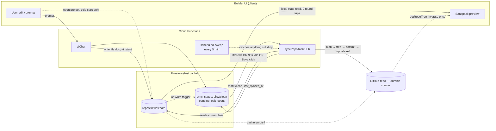

# AI website builder — unified engine plan

Status: phases 1–6 implemented **and deployed**; phase 4/5 frontend wiring
is also done (see "Phases 4/5/7" below — no longer paused); phase 7
(cleanup) still open. Companion to [CODE_REVIEW.md](./CODE_REVIEW.md). See
also [MULTI_AGENT_ORCHESTRATION.md](./MULTI_AGENT_ORCHESTRATION.md), which
sits upstream of everything in this document — it decides what `<file>`
blocks get produced; everything below about how those blocks get stored,
synced, and pushed to GitHub is unchanged by it.
[engine-diagram.html](./engine-diagram.html) has the visual version of the
read/write/sync path below.

## Deployment state (new — this used to only exist as source)

Everything below was verified live, not just read in source, via direct
Firebase Auth + Cloud Function + Firestore REST calls against the real
`empirialdesigns` project:

- **Firestore rules exist and are deployed** (`firestore.rules` +
  `firestore.indexes.json`, both new — see "closing note" below, previously
  true). Scoped to `users/{uid}`, `user_repos/{repoId}` (ownership via
  `resource.data.user_id`), and `user_repos/{repoId}/files|chat_messages/*`
  (ownership resolved through the parent doc via `get()`/`getAfter()` —
  `getAfter()` specifically because `createWebsite` writes the parent repo
  doc and its first file docs in one atomic batch, and a plain `get()` only
  sees pre-batch state).
- **All 7 Cloud Functions are deployed** (Node 20 — Node 18 was
  decommissioned; `createWebsite` runs with a 300s timeout / 512MB, since
  full-site generation plus one GitHub API call per file for the initial
  commit routinely takes 20-50s+ and would otherwise hit the platform's
  default 60s HTTP timeout).
- **The pipeline calls DeepSeek directly**, not OpenRouter — see
  [MULTI_AGENT_ORCHESTRATION.md](./MULTI_AGENT_ORCHESTRATION.md)'s model
  section for why. `DEEPSEEK_API_KEY`/`DEEPSEEK_MODEL` in `functions/.env`.
- **GitHub token is configured** (`GITHUB_TOKEN`, classic PAT, `public_repo`
  scope only — deliberately excludes `delete_repo`; repos this app creates
  land under whichever personal GitHub account owns the token).
- **Firebase Hosting is also deployed** (`empirialdesigns.web.app`) for the
  marketing/platform frontend itself — separate from the GitHub repos this
  engine creates for generated client sites.

### Two real bugs found only by testing the deployed path, not by reading the code

- **`createWebsite`'s GitHub commit silently landed on an empty repo.** The
  repo was created with `auto_init: false` (zero Git objects at all), then
  the code did `PATCH /git/refs/heads/main` to point that branch at the new
  commit — but `PATCH` only *updates* an existing ref, and there was no
  `main` branch yet to update. That call 404s; the response was never
  checked, so `createWebsite` reported success while GitHub showed "This
  repository is empty." Blobs/tree/commit were real, dangling Git objects —
  nothing pointed to them. Fixed by creating the repo with `auto_init: true`
  (a real first commit exists immediately) and building the generated
  commit on top of it as a real parent, at which point `PATCH` is correct.
  Added `.ok` checks on every GitHub API call in this path while in there
  (closes part of the "does not check every GitHub API response" finding in
  `CODE_REVIEW.md`).
- **`generateRepoName`'s regex misfired on ordinary prompts.** It tried to
  extract an explicit name after "for"/"named"/"called", but "for" is an
  extremely common word in natural prompts ("a website **for a** bakery",
  "a landing page **for my** startup") — the regex grabbed whatever word
  came right after it regardless of meaning, so a prompt like "a fitness
  studio website for a boutique gym" produced a GitHub repo literally named
  `a`. Fixed by dropping `for` as a trigger (keeping only the unambiguous
  `named`/`called`) plus a stopword/length check as a second safety net.

## Implementation status

- ✅ **Phase 1 — Firestore schema.** `functions/index.js`'s `createWebsite` now
  seeds `user_repos/{id}/files/{path}` (one doc per file) and the sync-status
  fields (`github_sync_status`, `pending_edit_count`, `last_edit_at`,
  `last_synced_at`, `last_commit_sha`) in one batch write.
- ✅ **Phase 2 — sync mechanics.** `syncRepoToGitHub` (reads the current
  `files` subcollection, commits blob → tree → commit → update ref, with
  chunked/concurrent blob creation), `onRepoFileWrite` (Firestore trigger,
  counts edits, flushes at the threshold), `scheduledRepoSync` (5-minute
  sweep, backstop for anything left `dirty`/`error`), `requestRepoSync`
  (explicit-flush HTTP endpoint, for a future Save/Publish button). A
  `tryClaimSync` transaction prevents the trigger, the sweep, and an
  explicit request from syncing the same repo concurrently. Defaults:
  **3-edit threshold**, **2-minute idle window** for the sweep — see "Open
  questions" below, now answered by these defaults unless you want them
  tuned.
- ✅ **Phase 3 — repoint `aiChat`.** It now resolves + verifies repo
  ownership before calling the AI provider at all. **Superseded/updated by
  [MULTI_AGENT_ORCHESTRATION.md](./MULTI_AGENT_ORCHESTRATION.md):** `aiChat`
  no longer makes one streaming OpenRouter call — it runs the multi-agent
  pipeline (`functions/pipeline.js`) and writes SSE frames to the client
  itself as each coder's result comes in, in the same wire shape a raw
  OpenRouter passthrough used, so the client-side reader is unaffected.
  Once the pipeline finishes, it parses `<file>` blocks out of the
  accumulated text and batch-writes them to `files/{path}` — `onRepoFileWrite`
  picks those writes up and drives the sync from there, unchanged. The real
  client-side consumer of this stream is
  `src/features/builder/lib/aiChat.ts` → `AssistantPanel.tsx` (not
  `Preview.tsx`, which is currently unmounted — see the routing note under
  Phases 4/5/7 below). Accepts an explicit `repoId` in the request body
  (preferred) or falls back to an owner/name lookup for callers that don't
  send one yet.
- ✅ **Phase 6 — ownership checks**, folded into phase 3's work rather than
  done separately. Added a shared `resolveOwnedRepo(uid, { repoId } | {
  repoOwner, repoName })` helper and applied it to `aiChat`,
  `getRepoContents`, `getRepoTree`, and `requestRepoSync` — every function
  that takes owner/repo (or repoId) from the client now verifies
  `user_id === decodedToken.uid` before touching GitHub or Firestore for
  that repo, closing the finding in `docs/CODE_REVIEW.md`.
- ✅ **Phase 4 — frontend wiring, resolved.** The two-competing-plans tension
  described below resolved itself: `RepoManagement.tsx`/`Preview.tsx` (the
  other plan's starting point) are deleted (see `git log` — they're gone,
  along with the rest of the legacy generator flow, superseding the
  "Phases A–F" plan referenced below). `BuilderPage.tsx` is the one live
  builder surface. It calls `createWebsiteFromPrompt` (`repos.service.ts`)
  for a fresh prompt — which calls the real `createWebsite` Cloud Function,
  not a client-only stub — and `AssistantPanel.tsx` calls the real `aiChat`
  via `streamAiChat` (`aiChat.ts`) for follow-up edits. Both verified live,
  not just wired: see "Deployment state" above.
- ✅ **Phase 5 — routing, resolved differently than originally planned.**
  Rather than a standalone `/repos` + `/builder/:repoId`, the live routes are
  `/dashboard/chat?prompt=...` (fresh prompt) and
  `/dashboard/editor/:repoId` / `/dashboard/preview/:repoId` (existing
  project) — both rendering `BuilderPage`, dispatched from inside
  `Platform.tsx`. `App.tsx` itself only routes `/`, `/auth`, and
  `/dashboard/*`.
- ⏸️ **Phase 7 — cleanup — still open**, see "Cleanup" section below.

## Phases 4/5/7 overlap the frontend consolidation plan — resolved

This section originally flagged a risk: two uncoordinated plans both touched
`AssistantPanel.tsx`/`BuilderPage.tsx`/`App.tsx` — this plan's phases 4/5/7,
and a separate "Phases A–F" plan starting from `RepoManagement.tsx`/
`Preview.tsx`. That risk is now moot. `RepoManagement.tsx` and `Preview.tsx`
are deleted; `BuilderPage.tsx` (this plan's approach) is what's live. Kept
below for history, not as an open question anymore.

## Coordination note (frontend consolidation work) — schema fork, now closed

A parallel frontend plan extracted `RepoManagement.tsx`/`Preview.tsx` logic
into `repos.service.ts` and wired `BuilderPage` to real projects. Its first
version of `getRepoFiles`/`saveRepoFiles`/`createRepoFromPrompt` targeted a
single `vfs` blob field, not the `files` subcollection shape above — the
exact fork this note originally warned about, confirmed by reading the code
rather than assuming.

Fixed in `repos.service.ts`:
- `getRepoFiles`/`saveRepoFiles` now read/write `user_repos/{id}/files/{path}`
  (one doc per file), matching what `createWebsite`/`aiChat` write server-side.
  `RepoAutosave.tsx`/`SaveButton.tsx` needed no changes — the fix was entirely
  underneath them.
- `createRepoFromPrompt` seeds the subcollection + sync-status fields instead
  of a `vfs` field. It still creates no real GitHub repo (`repo_url: ''`) —
  `syncRepoToGitHub` (functions/index.js) now treats an empty `repo_url` as
  "not GitHub-backed yet" and no-ops instead of erroring, since there's
  nowhere to push to until something gives the project a real repo.
- `createRepoFromGithubUrl` now accepts an `idToken` and calls `getRepoTree`
  to actually pull the imported repo's source into the subcollection —
  previously it saved only `repo_owner`/`repo_name`/`repo_url` and every
  imported project silently opened on the starter template. `ImportRepoDialog.tsx`
  updated to pass the token.
- `deleteRepo` now batch-deletes the `files` subcollection along with the
  project doc — Firestore doesn't cascade-delete, so this would otherwise
  have started leaking orphaned file docs the moment the schema moved off a
  single field.

**Resolved:** `createRepoFromTemplate` no longer sets the placeholder
`github.com/empirial-templates/...` repo_url/repo_owner — it wasn't a real,
accessible repo for the shared `GITHUB_TOKEN`, and had a truthy `repo_url`
that would have slipped past `syncRepoToGitHub`'s "no repo yet" guard.
Confirmed via grep that this function is currently unreachable from the UI
(Platform.tsx's template cards go through `createRepoFromPrompt` instead),
so this was dormant, not live — fixed anyway since it's exported and could
get wired up later. It now follows `createRepoFromPrompt`'s convention:
empty `repo_url`, seeded `files` subcollection, sync-status fields so the
guard treats it correctly if it ever starts receiving real edits.

**Resolved:** there was no `firestore.rules` file in this repo, which mattered
more once `repos.service.ts` started writing directly to the `files`
subcollection from the client — this was the actual cause of the
"Missing or insufficient permissions" errors seen when testing the live app.
`firestore.rules` + `firestore.indexes.json` now exist and are deployed —
see "Deployment state" above for the rule shape.

`SaveButton.tsx` also now calls `requestRepoSync` (fire-and-forget, after the
Firestore write succeeds) instead of leaving every save to wait on the
3-edit threshold or the 5-minute sweep — confirmed by reading the code that
this call was missing entirely; "Save" previously only ever wrote to
Firestore and never pushed anything to GitHub on its own.

## Figure 2 (cold-start GitHub fallback) — now actually implemented

Previously only true on paper. `getRepoFiles` was Firestore-only with no
fallback at all — a project with a real GitHub repo but an empty file cache
(data loss, or a repo that existed before these fixes) would silently open
on the starter template. Added:
- `hydrateFromGithub` in `repos.service.ts` — pulls a repo's source via
  `getRepoTree` and seeds the `files` subcollection. Shared by import and
  the new fallback (previously duplicated inline in `createRepoFromGithubUrl`
  alone).
- `hydrateRepoFilesFromGithubIfEmpty(repo, idToken)` — the fallback itself;
  no-ops for projects with no real `repo_url` (e.g. `createRepoFromPrompt`
  projects, where there's correctly nothing to fall back to).
- `BuilderPage.tsx` calls it only when `getRepoFiles` returns the
  `DEFAULT_FILES` constant by reference (i.e. the cache was actually empty)
  **and** the repo has a `repo_url` — so the common case (cache hit) pays
  no extra cost; the GitHub round trip only happens on the rare miss.

## Goal

Collapse the three uncoordinated generation paths (`functions/index.js` + GitHub,
`src/features/builder/` + mocked UI, `src/lib/claude.ts` legacy) into one engine:
GitHub is the durable, canonical store; Firestore is a fast write-behind cache
that live preview reads from; a server-driven sync policy keeps the two
consistent without making every AI edit wait on a GitHub round trip.

## Read path vs write path

The whole design rests on never letting live preview block on GitHub:

- **Write path (every AI edit):** write one small Firestore doc → preview updates
  instantly from local state. GitHub is not in this loop.
- **Sync path (batched, backgrounded):** triggered by an edit counter, an idle
  timer, an explicit Save, or a scheduled sweep — reads the current Firestore
  state and commits it to GitHub. Runs behind the user, never blocks typing.
- **Cold-start read path (opening a project):** check the Firestore cache first
  (fresher, if there are unsynced edits); fall back to GitHub (`getRepoTree`)
  only if the cache is empty.

See the diagram below for the full shape.

## Everything below this line is the original implementation plan

Kept for design rationale, not as an open TODO — every numbered item and
bullet from here through "Suggested implementation order" is done. See
"Implementation status" and "Deployment state" at the top of this document
for what's actually true today; treat past tense as implied throughout.

## Firestore schema changes

- `user_repos/{id}` gains: `github_sync_status: 'clean' | 'dirty' | 'syncing' | 'error'`,
  `pending_edit_count`, `last_edit_at`, `last_synced_at`, `last_commit_sha`.
- New subcollection `user_repos/{id}/files/{path}` — **one document per file**,
  not one giant `vfs` field. This is the fix for the failure mode in the current
  `Preview.tsx` autosave: a single Firestore document caps at 1 MiB, and a
  generated site's full source can approach that as it grows. Per-file docs
  also mean a one-component edit writes one small doc instead of rewriting
  every file in the project.

## Cloud Functions changes

1. **`aiChat`** — after parsing `<file>` blocks from the model response, write
   each changed file to `files/{path}` (not just stream text back), bump
   `pending_edit_count`, set `github_sync_status: 'dirty'`. Add the ownership
   check flagged in `docs/CODE_REVIEW.md`: verify `decodedToken.uid` owns the
   `repo_owner`/`repo_name` before touching it — apply the same check in
   `getRepoContents` and `getRepoTree`.
2. **`syncRepoToGitHub`** (new) — reads all docs in the `files` subcollection,
   commits the full current tree (blob → tree → commit → update ref, same
   shape `createWebsite` already uses). Full-tree pushes are safe to call
   repeatedly: git blobs are content-addressed, so re-pushing an unchanged
   file costs nothing and makes overlapping flushes idempotent — no diffing
   required.
3. **Firestore trigger on `files/{path}` writes** — increments
   `pending_edit_count` transactionally; when it reaches the threshold
   (default 3, configurable per repo later if needed), invokes
   `syncRepoToGitHub` directly. This makes the count/threshold decision
   server-side, so it isn't lost if the client disconnects right after the
   last edit lands.
4. **Scheduled sweep** (Cloud Scheduler, every ~5 min) — queries repos where
   `github_sync_status == 'dirty'` and `last_edit_at` is older than ~2 min,
   flushes each. This is the backstop for the case the counter never reaches
   3 (user makes 1–2 edits and closes the tab).
5. **Explicit Save/Publish/Export** — always force a flush via a callable
   function, regardless of counter state.
6. `createWebsite` keeps its job (initial generation + first commit) but
   switches its own file writes through the same `files` subcollection so the
   very first generation and all follow-ups go through one code path.

## Front-end changes

- `AssistantPanel.tsx`: flip `AI_WIRING_ENABLED` to true, call the real
  `aiChat` function. Remove the canned mock reply.
- `BuilderPage.tsx`: on mount, hydrate from the `files` subcollection (fall
  back to `getRepoTree` from GitHub only if that's empty); drop the static
  `starterTemplateFiles` as the default source for real projects (keep it only
  as the seed for a brand-new, not-yet-generated project).
- Small sync-status affordance in the topbar, read straight off
  `github_sync_status`/`pending_edit_count` (e.g. "3 unsynced edits" →
  "Synced to GitHub").
- `Preview.tsx`'s standalone Sandpack + ZIP-export + own chat loop folds into
  `BuilderPage` — same job, worse storage model. Keep the ZIP export feature,
  just move it.

## Routing changes

- `/repos` → project list (existing `RepoManagement.tsx` content), currently
  unmounted in `App.tsx` — mount it.
- Opening a project → a real `/builder/:repoId` route wired to that repo's
  `repo_owner`/`repo_name` (the current `/builder/:projectId` route just
  redirects to `/dashboard/projects`, which is dead — replace it).
- Retire the standalone `/preview/:id` destination once `BuilderPage` absorbs
  that job.

## Cleanup

- ✅ `src/pages/Dashboard.tsx`, `Builder.tsx`, `ChatInterface.tsx`,
  `GenerateWebsite.tsx`, `template.tsx`, plus `RepoManagement.tsx` and
  `Preview.tsx` — all deleted (see `docs/TO_DELETE.md`'s history in `git
  log`; that file is itself deleted now that its list is empty).
- ✅ `CLAUDE.md`'s "Current transition state" section updated to match.
- ⏸️ `src/lib/claude.ts` — confirmed fully dead (its only consumer,
  `LovableSidebar.tsx`, is itself never rendered anywhere), just not deleted
  yet. Candidate for the next cleanup pass.

## Suggested implementation order

1. Firestore schema (`files` subcollection + sync-status fields) — no
   behavior change yet, just the shape.
2. `syncRepoToGitHub` + the Firestore-write trigger + the scheduled sweep.
3. Point `aiChat` and `createWebsite` at the new subcollection.
4. Wire `BuilderPage`/`AssistantPanel` to the real functions; add the
   sync-status UI.
5. Fix routing (`/repos`, `/builder/:repoId`); fold `Preview.tsx` in.
6. Ownership checks on every function that takes `owner`/`repo` from the
   client.
7. Delete the legacy paths; update `CLAUDE.md`.

## Open questions

- Edit-counter threshold: is 3 the right default, or should it vary by how
  large a typical AI turn's diff is?
- Idle-sweep window: 2 minutes proposed above — acceptable staleness for a
  repo a user just… stopped touching?
- Does `Preview.tsx`'s ZIP export stay as-is, or should export also offer
  "clone the GitHub repo" now that GitHub is guaranteed current within one
  sync cycle?
